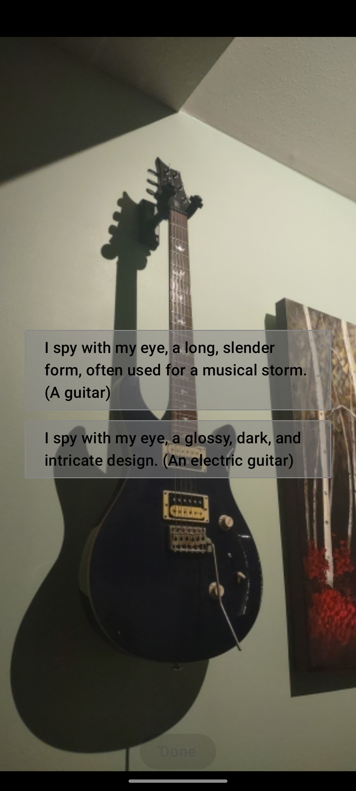

# EyesPie


[](https://www.gnu.org/licenses/gpl-3.0.en.html)
[](https://kotlinlang.org)
[](https://www.jetbrains.com/compose/)

> A game of "eye spy" with machine vision for clues and proof.



## Table of Contents

- [Overview](#overview)
- [Features](#features)
- [Architecture](#architecture)
- [Technology Stack](#technology-stack)
- [Prerequisites](#prerequisites)
- [Getting Started](#getting-started)
- [Development](#development)
- [Testing](#testing)
- [Deployment](#deployment)
- [Project Structure](#project-structure)
- [Contributing](#contributing)
- [License](#license)

## Overview

EyesPie is a Kotlin Multiplatform mobile game implementing "I Spy" with machine vision. Players create visual challenges using AI-generated clues and image obfuscation, while others guess using photo matching with embeddings.

### How It Works

1. **Create Challenge**: Alice takes a photo of something interesting. The app uses AI to generate clues and obfuscate the image (color, labels, blur/pixelate).

2. **Share Challenge**: The challenge is shared with friends or nearby players via geo-fencing.

3. **Guess**: Bob takes a picture of what he thinks matches the challenge. The app uses image embeddings to verify the match.

4. **Rewards**: Points are awarded for correct guesses, streak bonuses, and creative clues.

## Features

### Core Features
- **AI Vision for Clues**: Automatic clue generation using AI object recognition
- **Image-to-Image Matching**: AI verifies similarity between guesser's photo and original
- **Image Obfuscation**: Blur, pixelate, or sticker overlays with adjustable difficulty
- **Geo-Fencing**: Location-based challenges with "Local Legends" mode
- **Offline Support**: Capture and save challenges without connection, auto-sync when online

### Social Features
- **Friends & Teams**: Play with friends or join teams
- **Leaderboards**: Seasonal and all-time rankings
- **Daily Streaks**: Bonus rewards for consecutive play
- **Badges & Achievements**: Unlockable travel-themed frames and filters

### Advanced Features
- **Generative AI**: AI-powered clue creation and image analysis
- **Real-time Updates**: Live challenge feeds and notifications
- **Cross-platform**: iOS and Android support from single codebase

## Architecture

EyesPie follows Clean Architecture with feature-based modules:

### Bluebell Framework
Shared architecture foundation (`com.micrantha.bluebell`):
- **State Management**: Flux pattern (Store/Reducer/Effect)
- **UI Components**: Reusable Compose components and theming
- **Platform Abstractions**: Networking, file system, notifications
- **Observability**: Analytics, telemetry, and audit logging

### Core Module
Shared app infrastructure (`com.micrantha.eyespie.core`):
- **Data Repositories**: Account, AI, storage, system services
- **HTTP Client**: Supabase and REST API configuration
- **Location Services**: GPS and geocoding
- **Realtime**: WebSocket connections for live updates

### Domain Module
Business logic (`com.micrantha.eyespie.domain`):
- **Entities**: Game, Thing, Player, Location, Clues
- **Game Logic**: Distance calculations, match scoring
- **Repository Interfaces**: Data layer contracts

### Feature Modules
Feature-based packages:
- **Dashboard**: Home screen with friends/nearby/scan tabs
- **Game**: Game creation, listing, and details
- **Scan**: Camera capture with ML analysis
- **Login/Register**: Authentication flows
- **Players**: Player management and profiles
- **Guess**: Photo guessing gameplay
- **Onboarding**: First-run experience and AI model downloads

### Key Patterns
- **Screen/ScreenModel**: UI layer using Voyager navigation
- **Contract Classes**: Define UI state, actions, and effects
- **Repository Pattern**: Data layer abstraction with local/remote sources
- **Dependency Injection**: Kodein DI modules throughout
- **ML Pipeline**: Camera → Analyzer → TensorFlow/MediaPipe → Results

## Technology Stack

### Core Technologies
- **Kotlin Multiplatform**: Shared business logic across platforms
- **Compose Multiplatform**: Declarative UI framework
- **Supabase**: Backend-as-a-Service (Auth, Database, Storage, Realtime)
- **TensorFlow Lite**: On-device ML models
- **MediaPipe**: Google's ML solutions for mobile

### Libraries
- **Kodein DI**: Dependency injection
- **Voyager**: Navigation framework
- **Apollo GraphQL**: GraphQL client
- **SQLDelight**: Local database
- **Ktor**: HTTP client
- **Okio**: File I/O and caching

### Build Tools
- **Gradle**: Build system with Kotlin DSL
- **Fastlane**: CI/CD automation
- **CocoaPods**: iOS dependency management

## Prerequisites

- **JDK 17+**: Required for Kotlin Multiplatform
- **Android Studio**: Latest stable version with Kotlin Multiplatform plugin
- **Xcode**: 14.0+ (for iOS development)
- **CocoaPods**: iOS dependency manager
- **Supabase Account**: For backend services
- **Hugging Face Token**: For AI model access

## Getting Started

### 1. Clone the Repository

```bash
git clone https://github.com/hackelia-micrantha/eyespie.git
cd eyespie
```

### 2. Environment Setup

Copy the environment template and configure your keys:

```bash
cp env.example .env.local
```

Edit `.env.local` with your credentials:

```env
# Supabase (required for builds)
SUPABASE_URL=https://your-project.supabase.co
SUPABASE_KEY=your-anon-or-service-role-key

# AI Model Access (required for ML features)
HUGGING_FACE_TOKEN=your-token

# Development Credentials (optional)
LOGIN_EMAIL=eyespie@micrantha.test
LOGIN_PASSWORD=P@ssw0rd!

# Match Configuration (optional)
MATCH_THRESHOLD=0.5
MATCH_COUNT=5
```

### 3. Build the Project

```bash
# Build debug versions for both platforms
./gradlew build

# Or use Fastlane for CI-style builds
fastlane build_debug
```

### 4. Run the App

**Android:**
```bash
./gradlew assembleDebug
# Install on device/emulator
```

**iOS:**
```bash
cd iosApp
pod install
open iosApp.xcworkspace
# Build and run from Xcode
```

## Development

### Build Commands

```bash
# Full build
./gradlew build

# Android builds
./gradlew assembleDebug
./gradlew assembleRelease

# iOS builds (requires macOS)
fastlane ios build_debug
fastlane ios build_release

# Run tests
./gradlew test
./gradlew testDebugUnitTest
```

### Fastlane Commands

```bash
# Development builds
fastlane build_debug
fastlane build_release

# Testing
fastlane test

# Deployment
fastlane distribute_development
fastlane distribute_staging
fastlane distribute_production
```

### Code Style

- **Language**: Kotlin (Multiplatform + Compose)
- **Indentation**: 4 spaces
- **Naming Conventions**:
  - `PascalCase` for types and classes
  - `camelCase` for functions and variables
  - `UPPER_SNAKE_CASE` for constants
- **File Naming**: `PascalCase.kt` for classes, `camelCase.kt` for utilities

### IDE Setup

1. Install Kotlin Multiplatform plugin in Android Studio
2. Enable "Compose Multiplatform" in Settings → Experimental
3. Configure JDK 17+ in project settings
4. Sync Gradle files

## Testing

### Unit Tests

```bash
# Run all tests
./gradlew test

# Run Android unit tests
./gradlew testDebugUnitTest

# Run specific test class
./gradlew testDebugUnitTest --tests "com.micrantha.eyespie.features.game.GameLogicTest"
```

### Integration Tests

```bash
# Run integration tests
fastlane test

# Run UI tests (Android)
./gradlew connectedAndroidTest
```

### Test Structure

- **Unit Tests**: `eyespie/src/commonTest/`
- **Android Tests**: `eyespie/src/androidUnitTest/`
- **Integration Tests**: Feature-specific test directories

### Writing Tests

```kotlin
// Example unit test
class GameLogicTest {
    @Test
    fun `should calculate distance correctly`() {
        // Given
        val location1 = Location(lat = 40.7128, lng = -74.0060)
        val location2 = Location(lat = 40.7589, lng = -73.9851)
        
        // When
        val distance = Distance.calculate(location1, location2)
        
        // Then
        assertEquals(expected = 5.5, actual = distance, delta = 0.1)
    }
}
```

## Deployment

### Environment Setup

1. **Development**: Local testing with development credentials
2. **Staging**: Pre-production testing with staging Supabase project
3. **Production**: Live environment with production credentials

### Deployment Commands

```bash
# Deploy to development
fastlane distribute_development

# Deploy to staging
fastlane distribute_staging

# Deploy to production
fastlane distribute_production
```

### Release Process

1. Update version in `gradle.properties`
2. Create release branch: `git checkout -b release/v1.0.0`
3. Run tests: `fastlane test`
4. Build release: `fastlane build_release`
5. Deploy to staging: `fastlane distribute_staging`
6. Verify and approve
7. Deploy to production: `fastlane distribute_production`

## Project Structure

```
eyespie/
├── eyespie/                    # Main app module
│   ├── src/
│   │   ├── commonMain/         # Shared Kotlin code
│   │   ├── androidMain/        # Android-specific code
│   │   ├── iosMain/            # iOS-specific code
│   │   └── commonTest/         # Shared tests
│   └── bluebellAssets/         # ML model assets
├── bluebell/                   # Shared framework
│   └── src/
│       ├── commonMain/         # Shared framework code
│       ├── androidMain/        # Android implementations
│       ├── iosMain/            # iOS implementations
│       └── commonTest/         # Framework tests
├── iosApp/                     # iOS wrapper app
│   ├── iosApp/                 # iOS source code
│   ├── Podfile                 # CocoaPods dependencies
│   └── iosApp.xcworkspace      # Xcode workspace
├── supabase/                   # Backend configuration
│   ├── migrations/             # Database migrations
│   └── functions/              # Edge functions
├── fastlane/                   # CI/CD automation
│   ├── Fastfile                # Main automation scripts
│   ├── Fastfile.android        # Android-specific lanes
│   └── Fastfile.ios            # iOS-specific lanes
├── buildSrc/                   # Gradle build logic
├── design/                     # Design documentation
│   ├── overview.md             # User flow overview
│   ├── features.md             # Feature specifications
│   └── workflow.md             # Detailed workflows
└── docs/                       # Additional documentation
```

### Key Directories

- **`eyespie/src/commonMain/`**: Core business logic and UI shared across platforms
- **`bluebell/src/commonMain/`**: Reusable framework components
- **`supabase/migrations/`**: Database schema evolution
- **`fastlane/`**: Automated build and deployment pipelines

## ML Models & Assets

The app uses various TensorFlow Lite models for on-device ML:

- **Image Classification**: EfficientNet for object recognition
- **Object Detection**: Real-time object identification
- **Image Segmentation**: DeepLab for semantic segmentation
- **Image Embeddings**: MobileNet for image similarity matching
- **Style Transfer**: Artistic style application

Models are downloaded during onboarding and cached locally. Configuration is in `eyespie/build.gradle.kts`.

## Contributing

See [CONTRIBUTING.md](CONTRIBUTING.md) for detailed contribution guidelines.

### Quick Start

1. Fork the repository
2. Create a feature branch: `git checkout -b feature/amazing-feature`
3. Make your changes
4. Run tests: `./gradlew test`
5. Commit: `git commit -m "feat(scope): amazing feature"`
6. Push: `git push origin feature/amazing-feature`
7. Open a Pull Request

## License

Copyright © 2023 [Ryan Jennings](https://github.com/ryjen).

This project is [GPLv3](https://www.gnu.org/licenses/gpl-3.0.en.html) licensed. Please send me any changes you make.

## Support

- **Issues**: [GitHub Issues](https://github.com/hackelia-micrantha/eyespie/issues)
- **Discussions**: [GitHub Discussions](https://github.com/hackelia-micrantha/eyespie/discussions)
- **Security**: See [SECURITY.md](SECURITY.md) for vulnerability reporting

## Acknowledgments

- Built with Kotlin Multiplatform and Compose
- Powered by Supabase backend services
- ML models from TensorFlow Lite and MediaPipe
- Special thanks to all contributors

---

**Author:** Ryan Jennings

- Website: <https://ryanjennin.gs>
- GitHub: [@ryjen](https://github.com/ryjen)
- LinkedIn: [@ryjen](https://linkedin.com/in/ryjen)

[](https://ko-fi.com/B0B1LPW9M)
