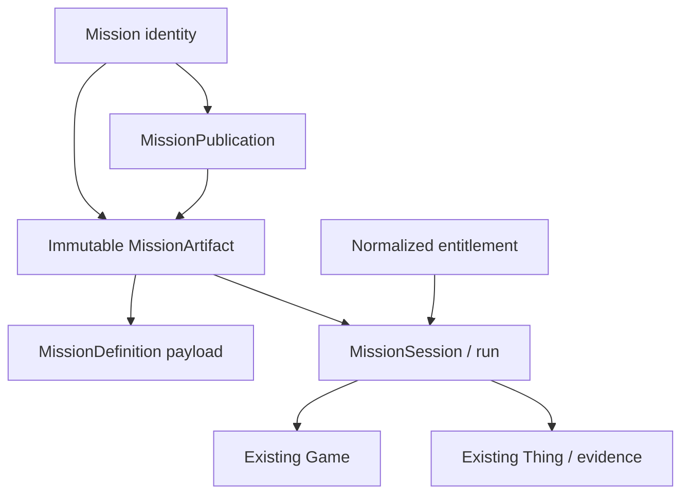

# Mission / Adventure Content Architecture

The normative decision is [ADR-0005](../adr/0005-mission-adventure-content-contract.md).

This document provides the concise implementation map for the post-alpha Mission / Adventure capability tracked by #103.

## Existing runtime model

Eyespie currently uses:

```text
Game
  -> live social/session container
  -> players, Things, expiry, limits, turn duration

Thing
  -> mutable player/runtime challenge evidence
  -> creator, image, location, embedding, guesses, guessed state
```

These remain valid alpha/runtime concepts. Mission content sits above them rather than replacing them.

## New content boundary



The important separations are:

- **definition** = canonical immutable authored payload;
- **artifact** = definition plus external `contentDigest` integrity envelope;
- **publication** = mutable operational availability/moderation state;
- **entitlement** = access state owned by ADR-0006/#104;
- **session** = player/group progress pinned to one artifact version;
- **Game / Thing** = existing runtime/session/evidence objects used where the mission mode needs them.

## Identity and digest

A cached or active mission artifact is identified by:

```text
missionId + contentVersion + contentDigest
```

The digest is **not** a field inside the payload it hashes:

```text
MissionArtifact
  contentDigest = SHA-256(canonicalize(definition))
  definition: MissionDefinition
```

`MissionDefinition` contains `schemaVersion`, `missionId`, `contentVersion`, publisher/content/task/policy fields, but not `contentDigest`.

This avoids a self-referential digest and gives both backend and KMP code one deterministic verification sequence: decode → validate → canonicalize definition → hash → compare envelope digest.

Published definitions are immutable. Any byte/content change creates a new `contentVersion` and digest.

## Publication lifecycle

```text
draft -> review -> published -> paused -> retired
```

Publication state is not part of the immutable definition payload.

A pause may be operational or safety-related. Safety pause uses fail-safe behavior and may stop active play at the next enforceable boundary.

## Verification boundary

Tasks reference an allowlisted, versioned verification profile compatible with #91.

Mission content cannot carry arbitrary authoritative match thresholds or platform-specific MediaPipe/model objects.

```text
MissionTask
  -> VerificationProfileRef
       -> approved policy/profile
       -> compatible embedding schema/model contract (#91)
```

## Distribution boundary

Authoring data can contain secrets or privileged validation material. Build separate delivery views when required:

```text
Authoring source
  -> player-visible package
  -> authority-only verification/moderation package
```

Do not assume every serialized authoring field is safe to ship to an untrusted mobile client.

## Persistence direction

Use additive post-alpha storage. Do not mutate the existing alpha `Game`/`Thing` tables merely to introduce Missions.

Recommended initial shape:

```text
Mission
MissionVersion       // canonical MissionDefinition payload + separate digest
MissionPublication   // active version + lifecycle/availability/moderation
MissionSession       // pinned player/group progress
```

Normalize task rows only when query/index/referential requirements justify it. Versioned JSON/JSONB is acceptable for the first immutable definition payload.

## Delivery slices

1. **#108 Shared contract + validator** — MissionDefinition/MissionArtifact DTOs, canonicalization/digest, typed validation, common tests.
2. **#109 Persistence + offline cache** — additive backend/client storage keyed by mission/version/digest; coordinate #16.
3. **#110 MissionSession integration** — pin runtime artifact identity; map to `Game`/`Thing` deliberately rather than replacing them.
4. **#111 Publishing + safety lifecycle** — publisher authorization, draft/review/publish/pause/retire, emergency safety pause with #107.

All slices are post-alpha and remain non-blocking for #90.
