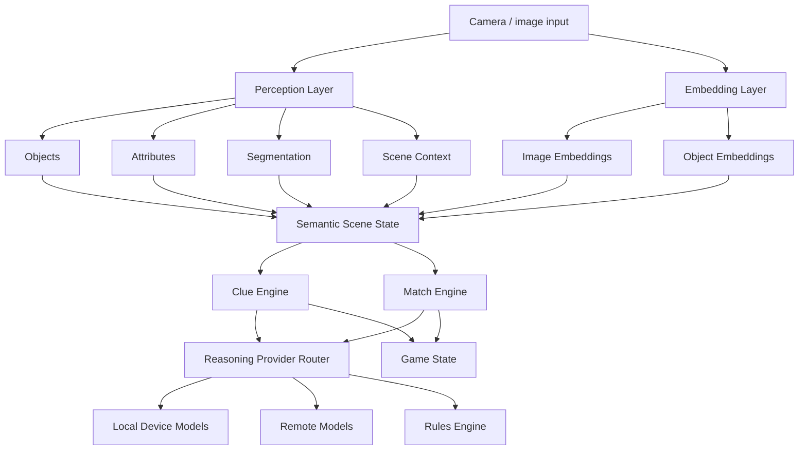
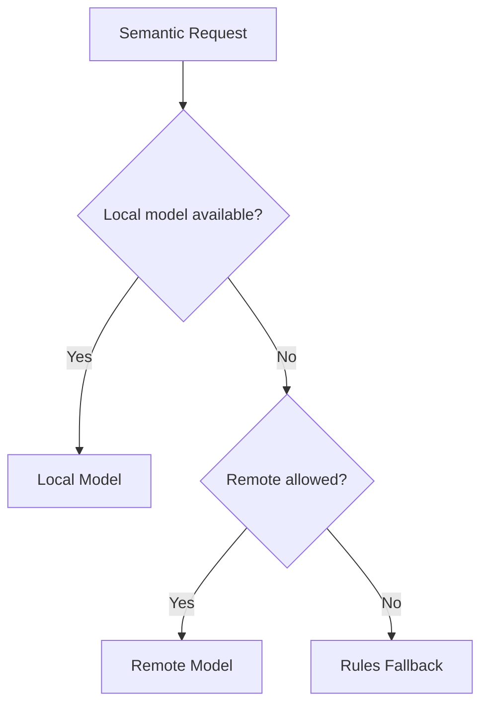

# Semantic Game Engine Architecture

## Overview

Eyespie uses a multimodal semantic game engine composed of:

- perception systems
- embeddings
- semantic reasoning
- matching/scoring
- provider routing

The architecture intentionally separates:

- grounded perception
- semantic interpretation
- retrieval/matching
- gameplay logic

This separation reduces hallucination risk and avoids coupling gameplay correctness to a single model provider.

---

# Architecture



---

# Design Principles

## Grounded Perception

Perception systems remain the authoritative source of observable evidence.

Examples:

- object detection
- segmentation
- OCR
- scene classification
- attribute extraction

LLMs should not replace perception systems for authoritative scene understanding.

---

## Embeddings as Core Retrieval Primitive

Embeddings are a core gameplay primitive.

Embedding use cases:

- visual similarity
- semantic similarity
- object candidate retrieval
- clue expansion
- ambiguity reduction
- semantic clustering

Potential embedding types:

- image embeddings
- object crop embeddings
- text embeddings
- scene embeddings

The system should support multiple embedding providers and future local vector indexing.

---

## Semantic Reasoning

LLM reasoning is a first-class gameplay system.

Primary responsibilities:

- clue generation
- hint generation
- semantic guess interpretation
- semantic closeness scoring
- accessibility descriptions
- dynamic difficulty adaptation

Reasoning should operate over structured context whenever possible.

Example structured context:

```json
{
  "label": "fire hydrant",
  "attributes": ["red", "metal", "street-side"],
  "avoid_words": ["fire", "hydrant"]
}
```

---

# Provider Routing

The system supports local-first execution.

## Local Providers

Potential providers:

- Apple Foundation Models
- Android Gemini Nano / AICore
- local ONNX/TFLite/CoreML models

Benefits:

- lower latency
- offline support
- improved privacy
- lower operating cost

## Remote Providers

Remote providers are fallback systems.

Potential providers:

- hosted OpenAI models
- hosted Gemini models
- hosted Anthropic models
- custom hosted inference

Remote execution should require explicit policy approval.

---

# Routing Strategy



---

# Matching Strategy

Matching combines multiple evidence sources.

Potential inputs:

- perception confidence
- embedding similarity
- semantic interpretation
- gameplay constraints
- ambiguity penalties

Example conceptual scoring:

```text
score = visual_similarity
      + semantic_similarity
      + perception_confidence
      + gameplay_bonus
      - ambiguity_penalty
```

The architecture intentionally avoids fully LLM-owned scoring.

---

# Semantic Candidate Model

Potential canonical model:

```ts
interface SemanticCandidate {
  id: string

  labels: Array<{
    value: string
    confidence: number
    source: string
  }>

  attributes: {
    color?: string[]
    shape?: string[]
    material?: string[]
    location?: string[]
  }

  embeddings: {
    image?: Float32Array
    crop?: Float32Array
    text?: Float32Array
  }

  provenance: {
    provider: string
    model: string
    timestamp: string
  }
}
```

---

# Provenance and Evaluation

Generated clues and semantic decisions should preserve:

- model provider
- model identifier
- prompt version
- generation timestamp
- local vs remote execution

This supports:

- replayability
- debugging
- evaluation
- fairness analysis
- future regression testing

---

# Risks

## Nondeterminism

Different providers or model versions may produce:

- different clues
- different semantic interpretations
- different scoring behavior

Evaluation infrastructure will likely become necessary.

## Device Fragmentation

Local model capability differs across:

- iOS versions
- Android vendors
- hardware classes
- memory availability

The provider layer must support graceful degradation.

## Privacy

Camera-derived scene data may contain:

- people
- homes
- locations
- sensitive objects

The architecture therefore defaults to local-first reasoning.

---

# Future Directions

Potential future additions:

- semantic memory systems
- scene persistence
- multiplayer authoritative evaluation
- vector databases
- replay harnesses
- federated personalization
- difficulty-learning systems
- temporal reasoning over video
