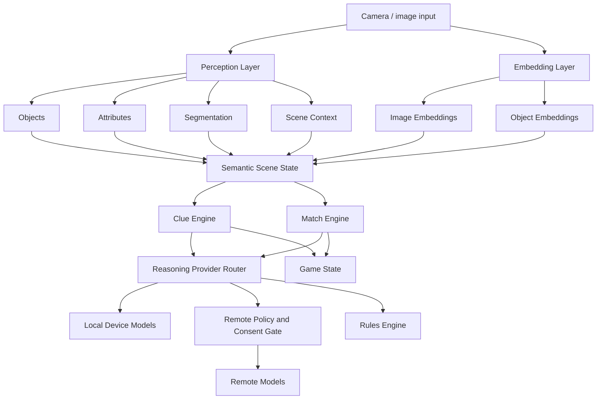
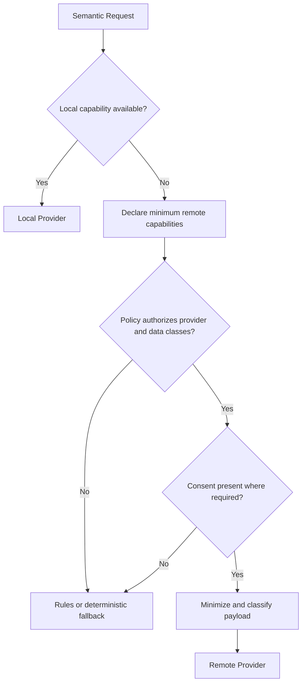

# Semantic Game Engine Architecture

## Overview

Eyespie uses a multimodal semantic game engine composed of:

- perception systems
- embeddings
- semantic reasoning
- matching/scoring
- provider routing

The architecture intentionally separates:

- grounded perception
- semantic interpretation
- retrieval/matching
- gameplay logic

This separation reduces hallucination risk and avoids coupling gameplay correctness to a single model provider.

---

# Architecture



---

# Design Principles

## Grounded Perception

Perception systems remain the authoritative source of observable evidence.

Examples:

- object detection
- segmentation
- OCR
- scene classification
- attribute extraction

LLMs should not replace perception systems for authoritative scene understanding.

---

## Embeddings as Core Retrieval Primitive

Embeddings are a core gameplay primitive.

Embedding use cases:

- visual similarity
- semantic similarity
- object candidate retrieval
- clue expansion
- ambiguity reduction
- semantic clustering

Potential embedding types:

- image embeddings
- object crop embeddings
- text embeddings
- scene embeddings

The embedding and index subsystem owns raw vector values. Domain and gameplay layers should exchange typed references and metadata rather than platform-specific vector containers.

An embedding reference should identify:

- model identifier and version
- dimensions
- normalization strategy
- similarity metric
- storage key or lifecycle scope

This allows providers to change without making vectors from incompatible models appear interchangeable.

---

## Semantic Reasoning

LLM reasoning is a first-class gameplay system.

Primary responsibilities:

- clue generation
- hint generation
- semantic guess interpretation
- bounded semantic evidence
- accessibility descriptions
- dynamic difficulty adaptation

Reasoning should operate over structured context whenever possible.

Example structured context:

```json
{
  "label": "fire hydrant",
  "attributes": ["red", "metal", "street-side"],
  "avoid_words": ["fire", "hydrant"]
}
```

Reasoning output is advisory evidence. It cannot replace authoritative perception confidence or directly determine the final score.

---

# Provider Routing

The system supports local-first execution and denies remote execution by default.

## Local Providers

Potential providers:

- Apple Foundation Models
- Android Gemini Nano / AICore
- local ONNX/TFLite/CoreML models

Benefits:

- lower latency
- offline support
- improved privacy
- lower operating cost

## Remote Providers

Remote providers are policy-controlled fallback systems.

Potential providers:

- hosted OpenAI models
- hosted Gemini models
- hosted Anthropic models
- custom hosted inference

A remote route requires all of the following:

1. the request declares the minimum data capabilities it requires
2. policy authorizes those capabilities for the selected provider
3. user consent exists where required
4. payload minimization removes all unapproved fields

Policy authorization and user consent are distinct gates. Consent does not override policy, and policy does not imply consent.

Sensitive data classes require explicit capabilities, including:

- raw images or video frames
- object crops
- OCR text
- faces or biometric features
- precise location
- persistent scene history

Fallback routing must never silently broaden the transmitted payload.

## Routing Strategy



Each remote decision records:

- requested capability set
- authorized capability set
- consent basis
- transmitted field classes
- provider and model
- local or remote execution

---

# Matching Strategy

Matching combines multiple evidence sources.

Potential inputs:

- perception confidence
- embedding similarity
- bounded semantic evidence
- gameplay constraints
- ambiguity penalties

Raw values from different providers are not directly additive. Each signal must be normalized or calibrated against its model/version and evaluation corpus before aggregation.

Conceptual scoring pipeline:

```text
normalized_visual = calibrate(visual_similarity, visual_model_version)
normalized_semantic = calibrate(semantic_similarity, semantic_model_version)
normalized_perception = calibrate(perception_confidence, perception_model_version)

score = aggregate(
    normalized_visual,
    normalized_semantic,
    normalized_perception,
    gameplay_constraints,
    ambiguity_penalty
)
```

The scoring policy must define:

- expected range and calibration method for each signal
- model/version-specific thresholds
- behavior when signals are missing
- abstention or rejection thresholds
- deterministic tie-breaking
- score provenance

The architecture intentionally avoids fully LLM-owned scoring.

---

# Semantic Candidate Contract

The semantic candidate is a language-neutral domain contract. Kotlin, Swift, and any tooling implementation may map it into platform-native types, but the contract must not depend on a platform-specific vector or serialization type.

```text
SemanticCandidate
  id: CandidateId
  labels: List<LabelEvidence>
  attributes: AttributeEvidence
  embeddings: List<EmbeddingRef>
  provenance: Provenance

LabelEvidence
  value: String
  confidence: NormalizedScore
  source: EvidenceSource

EmbeddingRef
  kind: IMAGE | OBJECT_CROP | TEXT | SCENE
  modelId: String
  modelVersion: String
  dimensions: Integer
  normalization: Normalization
  similarityMetric: SimilarityMetric
  storageKey: Optional<OpaqueKey>

Provenance
  provider: String
  modelId: String
  modelVersion: String
  generatedAt: Timestamp
  executionLocation: LOCAL | REMOTE | RULES
```

Raw vectors do not belong in general application state. They remain in the embedding/index subsystem and are accessed through `EmbeddingRef` when matching requires them.

A reference with a missing `storageKey` may represent an ephemeral embedding whose lifecycle is bounded to the active operation.

---

# Provenance and Evaluation

Generated clues, matching signals, remote decisions, and final scores should preserve:

- model provider
- model identifier and version
- prompt version where applicable
- generation timestamp
- local, remote, or rules execution
- policy and consent decision identifiers for remote execution
- transmitted field classes for remote execution
- calibration version
- contributing signals and missing signals

This supports:

- replayability
- debugging
- evaluation
- fairness analysis
- privacy auditing
- future regression testing

---

# Risks

## Nondeterminism

Different providers or model versions may produce:

- different clues
- different semantic interpretations
- different scoring behavior

Evaluation infrastructure will likely become necessary.

## Device Fragmentation

Local model capability differs across:

- iOS versions
- Android vendors
- hardware classes
- memory availability

The provider layer must support graceful degradation.

## Privacy

Camera-derived scene data may contain:

- people
- homes
- locations
- sensitive objects

The architecture therefore defaults to local reasoning. Remote execution requires explicit capabilities, policy authorization, consent where applicable, and payload minimization.

---

# Future Directions

Potential future additions:

- semantic memory systems
- scene persistence
- multiplayer authoritative evaluation
- vector databases
- replay harnesses
- federated personalization
- difficulty-learning systems
- temporal reasoning over video
