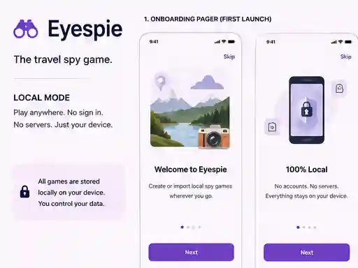
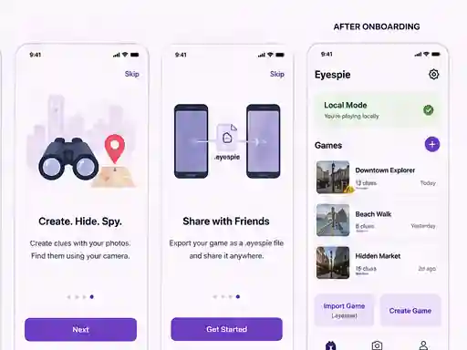
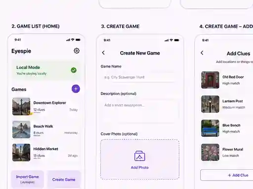
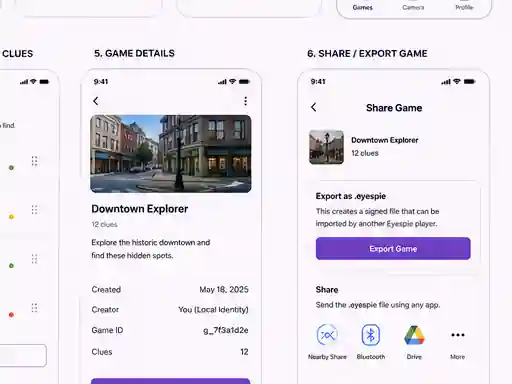
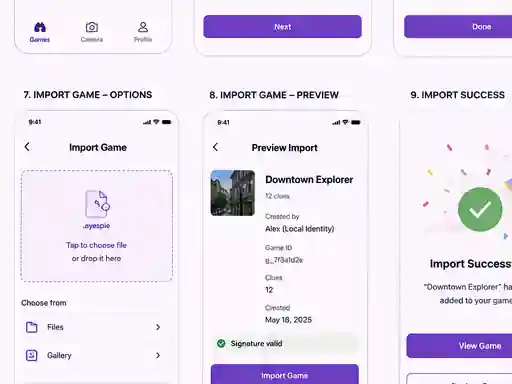
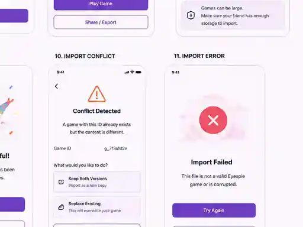
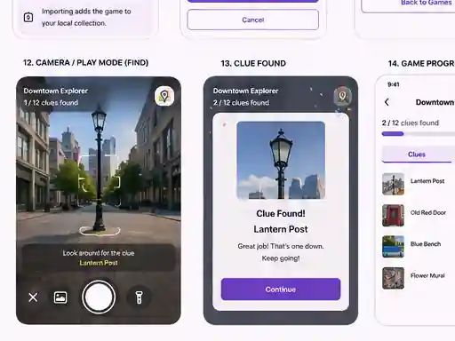
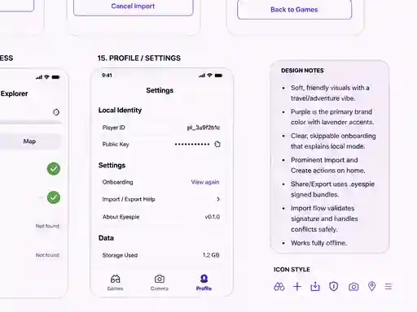

# Eyespie app mockups

Whole-app UX concept for [#220](https://github.com/ryjen/eyespie/issues/220), captured 2026-08-21.

These are exploratory design mockups for discussion and iteration, not a pixel-exact implementation contract. Where the visual board conflicts with current authority, platform, or security contracts, the implementation constraints below are authoritative.

The original board is stored as eight review-friendly tiles preserving the full layout:

| Left | Right |
|---|---|
|  |  |
|  |  |
|  |  |
|  |  |

## Scope

The board covers:

- local-mode onboarding;
- game list, creation, clue authoring, and game details;
- signed `.eyespie` share/export;
- import selection, preview, success, conflict, and invalid-file states;
- camera/play mode and clue-found feedback;
- game progress;
- profile/settings and re-openable onboarding.

## Implementation corrections to the visual board

The generated board contains a few exploratory actions/copy that must **not** be implemented as shown:

- **Import source:** `.eyespie` is a document bundle. Use the native document picker / OS open-in or share flow. Do not expose a Gallery/Photos import source.
- **Conflict handling:** a differing bundle with an existing signed `GameId` is non-mutating under the current local-authority contract. Do not offer `Keep Both Versions` or `Replace Existing`. Present the conflict and allow the user to cancel/back out unless a future authority-safe conflict contract is explicitly designed.
- **Local/privacy wording:** "local" means no hosted Eyespie backend is required for core play and original target images are not exported. A shared `.eyespie` bundle does contain gameplay data including target embeddings. Signatures provide integrity/provenance, not confidentiality; a recipient who controls their device can inspect bundle contents. Do not present the portable format as an anti-cheat or secrecy boundary.

## Notes

- Local-only/backendless remains the product model.
- `.eyespie` is the signed portable game format.
- Treat this board as UX direction for #220, with the corrections above as the implementation contract where they differ from the generated visuals.
- The tiles are lightly compressed for repository review while preserving the complete board composition.
