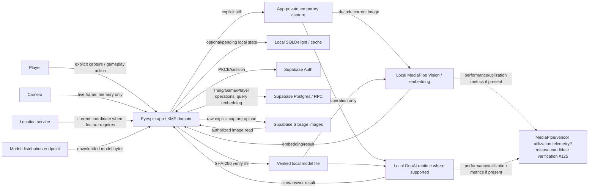

# Eyespie Privacy and Security Threat Model

## Status

Baseline threat model for the closed-alpha/public-beta path tracked by #18 and #90.

This document describes the **free/core game baseline**. Post-alpha paid content, public geofenced UGC, entitlement/payment fraud, creator publishing/payouts, and commercial moderation incentives are explicitly deferred to #107.

Current implementation defects are called out as open release mitigations rather than being described as already safe.

## Scope

In scope for the alpha baseline:

- camera preview and explicit still captures;
- image decoding/preprocessing;
- on-device MediaPipe/embedding inference;
- current optional Android GenAI clue inference;
- generated clues/answers and verification evidence;
- exact/current location used by gameplay;
- local temporary files and SQLDelight cache/pending state;
- Supabase Auth, Postgres/RPC, and Storage;
- model download, local model files, and integrity verification;
- app diagnostics/logging;
- vendor/runtime telemetry relevant to MediaPipe;
- social Player/Game/Thing authorization boundaries;
- future AR/spatial privacy constraints at the architecture boundary only.

Out of scope here:

- commercial catalog/entitlements (#104+);
- product analytics beyond ensuring it remains separate (#105+);
- public creator/organization mission abuse (#107);
- payment/refund/payout fraud (#107);
- detailed AR feature implementation (#8).

## Security/privacy objectives

Eyespie should satisfy the following defaults:

1. **Capture intentionally.** Live camera frames remain transient; only an explicit still-capture action creates a persisted image.
2. **Minimize disclosure.** A gameplay participant receives only the image/location/proof/identity fields needed for that interaction.
3. **Local-first inference.** Raw camera input stays on-device for model processing unless a separately authorized remote capability explicitly requires transmission.
4. **No hidden history.** Model/provider requests contain only the current operation's declared context.
5. **Derived data is sensitive.** Embeddings, generated answers/proof, and exact location receive protection comparable to the underlying content they can reveal or correlate.
6. **Bearer material is ephemeral.** Signed URLs, credentials, tokens, local private paths, and provider evidence are never durable domain identities or normal log fields.
7. **Server authorization is authoritative.** Untrusted clients and user-supplied identifiers do not decide access to another player's sensitive data.
8. **Fail closed on integrity/authorization.** Corrupt model/content, unsupported verification state, or unauthorized data access does not silently degrade into permissive behavior.
9. **Deletion/retention is bounded by purpose.** Raw temporary captures and stale sensitive caches are removed when no longer needed.
10. **Privacy claims follow evidence.** “On-device” does not imply “no vendor telemetry”; release disclosures match observed candidate behavior.

## Sensitive assets and classification

| Asset | Classification | Primary risks | Alpha policy |
| --- | --- | --- | --- |
| Live camera frames | Restricted / ephemeral | bystanders, homes, documents, faces, sensitive objects | memory only; no raw-frame persistence by default |
| Explicit still capture | Restricted | same as frame plus durable replay | app-private temporary copy until upload/cancel; remote copy only for authorized gameplay |
| Image storage object key | Sensitive identifier | object enumeration/access | opaque; not itself authorization |
| Signed image URL | Restricted bearer capability | anyone with URL may fetch until expiry | transient/short-lived only; never canonical Thing identity (#122) |
| Exact latitude/longitude | Restricted | stalking, home/work inference, movement correlation | purpose-specific; not public/social profile state (#122/#126) |
| Image embedding | Restricted derived biometric/content-like signal | reidentification, inversion/retrieval, cross-record correlation | never broad listing/log/analytics field; matching only by approved path |
| Generated clue text | Sensitive gameplay content | private-scene inference, accidental disclosure | show intentionally to players; no general telemetry/logging |
| Hidden answer/proof | Restricted gameplay authority | answer leakage, cheating, scene inference | authority/minimum participant path only; no debug logging (#123) |
| Query embedding | Restricted transient derived data | cross-content matching/reidentification | transmit only to authorized matching RPC; do not log |
| Player display profile | Social/purpose-limited | unwanted discovery | explicit safe projection only |
| Auth `user_id`, email/account binding | Restricted identity | account correlation | private/account boundary; not social listing (#126) |
| `last_location` / presence | Restricted | stalking/live tracking | do not expose to arbitrary authenticated users; retain only if required (#126) |
| Local model file | Security-critical executable/inference input | tampering, malicious/corrupt inference | exact SHA-256 verified before initialization (#9) |
| Model URL/checksum/path | Sensitive operational metadata | supply-chain targeting/path leakage | bounded configuration; no normal diagnostic exposure |
| Supabase auth/session tokens | Secret | account takeover | platform/client auth storage only; never logs/analytics/content |
| Local private file paths | Sensitive operational metadata | device/user path disclosure | internal only; never remote telemetry/log output |
| Future spatial maps/anchors/poses | Restricted/high sensitivity | room layout, movement, persistent place tracking | not persisted by default; #8 remains later phase |

No camera/location-derived field becomes “public” merely because the user is authenticated or participates in social gameplay.

## Data-flow diagram



The dotted vendor-telemetry path is intentionally unresolved in this baseline until #125 verifies the exact Android and project-specific iOS release artifacts. It is separate from Eyespie/Supabase application uploads.

## Trust boundaries

### TB1 — Sensors -> application

Camera/location input originates outside normal application-domain trust.

Controls:

- platform permission gates;
- explicit capture action for still persistence;
- frame lifecycle/backpressure rules (#11/#97);
- validate image encoding/decoding failures;
- do not trust EXIF/location metadata as authority;
- minimize precise location collection to a concrete gameplay need.

### TB2 — Application memory -> local persistence

Temporary images, SQLDelight records, cached embeddings, clues, and location become recoverable data when written to disk.

Controls/requirements:

- app-private storage by default;
- explicit ownership and cleanup lifecycle (#124);
- no accidental Photos/Gallery persistence;
- bounded cache/offline retention (#16);
- account-switch/logout isolation for account-scoped sensitive cache;
- local DB is not assumed secret merely because it is app-private on an uncompromised device.

### TB3 — Application -> local inference/runtime

MediaPipe/GenAI libraries process sensitive current-operation data.

Controls/requirements:

- model artifact integrity before initialization (#9);
- canonical embedding/model compatibility (#91);
- current-operation-only model context (#123);
- no raw prompt/output/path logging (#123);
- verify third-party runtime telemetry separately (#125).

### TB4 — Application -> Supabase/Auth/Storage/Postgres

Network/backend is a major trust boundary. Client-supplied player IDs, Thing IDs, coordinates, proof, embeddings, and paths are untrusted.

Controls/requirements:

- authenticated transport/session;
- RLS and storage policy based on `auth.uid()`/server relationships, not client claims;
- least-data projections instead of wildcard/full authority rows;
- short-lived/transient signed URLs only after authorization;
- no broad authenticated visibility for exact location, auth principals, embeddings, hidden proof, or image bearer capabilities (#122/#126);
- input validation and bounded RPC result shapes.

### TB5 — Model distribution -> executable/inference input

Downloaded model bytes can alter inference behavior and may be attacker-controlled if supply chain is compromised.

Implemented control:

- #9 verifies configured SHA-256 of actual model bytes after download and immediately before initialization; corrupt/missing/malformed artifacts fail closed.

Remaining release controls include exact model provenance/SBOM/distribution evidence (#24/#72/#93); commercial redistribution licensing remains #106/#121 and is not part of this security threat gate.

### TB6 — Application/runtime -> third-party telemetry

If MediaPipe emits performance/utilization metrics, that is a third-party data flow even when inference input remains on-device.

Controls/requirements:

- verify actual candidate behavior on Android/iOS (#125);
- do not intentionally add Eyespie image/embedding/clue/location/path/token data to vendor telemetry;
- consent/disclosure must precede or match actual collection where required;
- #94 must not claim “entirely local/no third-party processing” without release evidence.

## Current alpha flows

### Challenge creation

Target flow after open mitigations:

```text
camera preview
  -> transient frame
  -> explicit still
  -> app-private temp file
  -> current-image clue inference
  -> current-image embedding generation
  -> user selects clue
  -> image upload under authorized object key
  -> Thing authority record stores minimum required proof/location/embedding/object identity
  -> temporary local capture deleted
```

Current deviations:

- Android capture currently uses MediaStore before copying to cache; cleanup/persistence must be corrected by #124.
- upload currently creates/persists a 365-day signed image URL; #122 replaces it with object identity + authorized transient access.
- current Thing RLS exposes full rows to every authenticated user; #122 narrows this.
- GenAI clue repository accumulates previous image paths/session context and logs raw output; #123 fixes it.

### Guess/matching

Current app computes local matches from locally cached embeddings and also sends a query embedding to the Supabase `match_things` RPC.

The backend RPC currently returns a JSON representation of the matching `Thing` row in addition to ID/similarity. After #122 least-privilege changes, matching must return only the data required by the guess flow; it must not become a bypass around narrowed table/storage policies.

Matching policy requirements:

- embedding schema/model compatibility is explicit (#91);
- query embeddings are not logged/analytics fields;
- thresholds are calibrated/versioned, not client-authoritative where competitive correctness matters;
- arbitrary users cannot retrieve another Thing's raw embedding/location/hidden proof as a side effect of matching;
- malformed/wrong-dimension input fails predictably.

### Player/social data

Current Player RLS exposes the full Player row to authenticated users, including auth binding and `last_location` in the existing schema.

Target:

- explicit public/social profile projection;
- private account/location state isolated;
- purpose-specific nearby/game APIs return minimum required data;
- #126 implements/tests this boundary.

## Retention defaults

These are target defaults for #18. Where current implementation differs, the referenced mitigation issue must reconcile it before release sign-off.

| Data | Local retention default | Backend retention default | Deletion/expiry trigger |
| --- | --- | --- | --- |
| Live preview frame | memory only; release immediately after consumer finishes | never upload merely for preview | frame lifecycle completion |
| Explicit raw still | app-private temp only | one authorized Storage object when challenge saved | local delete after upload/cancel; remote delete with Thing/account/content lifecycle |
| Failed/retry capture | bounded retry/offline period only | none until accepted upload | retry TTL/abandon/cleanup policy (#16/#124) |
| Embedding | memory/cache only as required for current matching | persisted only if required for Thing matching authority | delete/retire with Thing/account according to backend policy |
| Query embedding | operation lifetime | RPC processing only unless explicit evaluation fixture policy | request completion |
| Exact capture location | operation/cache only where needed | retain only if gameplay needs Thing location | delete/retire with Thing; avoid separate indefinite profile history |
| `last_location` | avoid or short-lived if feature requires | not public; retain only under explicit feature policy | expiry/account deletion (#126) |
| Generated clue shown to player | current challenge/cache as needed | Thing content only if product needs replay | Thing/account deletion/content lifecycle |
| Hidden answer/proof | minimum local lifetime | authority record only where required | Thing/account deletion/content lifecycle |
| Signed image URL | memory/UI request lifetime only | **do not persist as domain state** | short expiry / discard immediately after use (#122) |
| PendingCapture SQL row | not approved for unbounded use | n/a | explicit TTL/sync/abandon cleanup before #16 rollout |
| Local model file | until model replacement/uninstall | n/a | replacement/uninstall/integrity failure cleanup |
| Diagnostics | bounded non-sensitive codes only | shortest release-support retention practical | documented #93 retention |
| Future spatial map/anchor | none by default | none by default | explicit future opt-in policy only (#8) |

Account deletion/export and backend retention mechanics must ultimately cover Thing images, embeddings, location, proof, Player private state, and authorized diagnostics. Closed alpha may use bounded test-account/data cleanup procedures if full self-service deletion is not yet exposed, but “retain forever” is not an acceptable implicit policy.

## Remote upload constraints

### Raw images

Raw explicit captures may be uploaded only to the Eyespie/Supabase gameplay storage path required for the shared challenge. They are not sent to model providers by default merely because a provider supports images.

Future remote reasoning requires the semantic provider gate in `docs/architecture/semantic-game-engine.md`:

1. declare minimum data capabilities;
2. policy authorizes provider/data classes;
3. user consent exists where required;
4. payload is minimized;
5. provenance records execution/provider without logging payload content.

### Location

Do not transmit exact location to a model provider unless a future feature explicitly requires it and passes the same capability/policy/consent/minimization gate.

### Embeddings

Embeddings may cross the client/backend boundary for the matching service. They are not harmless metadata and must not be forwarded to unrelated analytics/model providers.

### Prompts/clues/answers

Generated/user-selected clue content may be persisted for gameplay, but hidden answers and raw model output are not generic log/analytics data. #123 removes the current raw-output debug path.

## Threat analysis and mitigations

| Threat | Example | Impact | Baseline mitigation / owner |
| --- | --- | --- | --- |
| Stalking / location leakage | enumerate Player/Thing coordinates | physical safety/privacy | #122, #126; least-data projections; no global exact-location reads |
| Image bearer leakage | copied 365-day signed URL | long-lived unauthorized image access | #122: object key + authorized short-lived access |
| Raw image over-retention | Android gallery copy/temp files survive | device/privacy exposure | #124 app-private temp + cleanup |
| Cross-capture AI context leak | image A remains in image/session context for image B | wrong clues/private scene contamination | #123 per-operation context/session reset |
| Prompt/output leakage | debug log contains generated answers/clues | privacy/cheating | #123 bounded diagnostics only |
| Model tampering | modified downloaded model changes inference | integrity/safety | #9 SHA-256 fail-closed before init |
| Embedding model mismatch | incompatible vectors compared as same space | false positives/correctness | #91 typed/versioned embedding contract |
| Embedding inversion/reidentification | embedding correlated/reconstructed | derived-data privacy | treat restricted; no broad rows/logs; #122 |
| Match/RPC over-disclosure | matching returns entire Thing authority row | bypass field minimization | #122 minimal matching projection/authorization |
| Client authorization spoofing | forged player/thing owner ID | cross-account write/read | Supabase auth + RLS; #122/#126 tests |
| False-positive manipulation | crafted/canned image/embedding wins | gameplay integrity | #91 calibration/provenance; later fraud amplification #107 |
| Replay/canned capture | reuse old image instead of live target | gameplay integrity | alpha evaluation/fairness policy; commercial fraud extension #107 |
| Model supply-chain substitution | compromised URL/artifact | arbitrary inference behavior | #9 + #72/#93 exact artifact evidence |
| Vendor telemetry surprise | local inference emits utilization metrics | undisclosed third-party processing | #125 candidate verification + #94 disclosures |
| Offline sensitive cache growth | PendingCapture stores path/location/clues/embedding indefinitely | local exposure | #16 must define TTL/cleanup before rollout; #124 capture ownership |
| Account-switch leakage | cached player/Thing data shown under next account | privacy | account-scoped cache purge/isolation requirement; validate in #16/#92 |
| Sensitive error logging | exception contains signed URL/path/token | credential/privacy leak | #93 bounded diagnostic codes; #9/#123 explicit redaction |
| AR spatial persistence | future room map/anchor retained/uploaded | high physical/privacy exposure | #8 no persistence by default; future explicit policy before implementation |

## Abuse/fail-safe defaults

### Unauthorized data read

Fail closed. Do not broaden RLS or return full authority rows because a UI/listing path lacks a tailored projection.

### Model integrity failure

Fail closed before inference. Do not mark setup ready or fall back to an unverified artifact. #9 is complete.

### Unsupported/failed local AI

Do not silently broaden to remote raw-image/location transmission. Use deterministic/rules fallback or explicit unavailable state according to #13/semantic provider policy.

### Location unavailable/denied

Feature should degrade to a clearly bounded no-location state where possible. Do not fabricate coordinates or reuse stale another-user/current-account location as if current.

### Analytics/diagnostics unavailable

Gameplay continues. Do not add sensitive payloads to logs simply because a structured diagnostic path failed.

### Backend unavailable

Do not discard a capture required for an explicitly supported retry flow until its bounded retention policy says to abandon it; equally, do not create an indefinite local raw-image queue. #16 owns the full offline policy.

## Model download and supply-chain requirements

#9 is the authoritative implemented model-integrity control:

- expected SHA-256 must be present/well formed;
- actual downloaded bytes are streamed through SHA-256 verification;
- corrupt/missing files fail before onboarding readiness;
- exact local artifact is reverified immediately before GenAI initialization;
- verifier diagnostics avoid URL/path/token/digest disclosure.

This mitigates substitution/corruption after an expected digest is trusted. It does not prove the expected digest itself was sourced from a trustworthy release process; #72/#93 provide the reproducible artifact/release evidence around that trust root.

## Logging and observability policy

Release diagnostics (#93) and future product analytics (#105/ADR-0007) are distinct channels, but both use default-deny sensitive fields.

Never log as ordinary fields:

- raw image/frame bytes;
- base64/image URLs with bearer query tokens;
- embeddings/query vectors;
- exact location;
- generated hidden answers/raw prompt/model output;
- auth/session tokens or credentials;
- local private file paths;
- model download URLs or secret headers;
- full Supabase/provider error payloads if they may contain the above.

Prefer stable diagnostic code + bounded operation stage + platform/release identity.

## Future AR/spatial privacy boundary

#8 remains non-MVP and optional. Before any spatial implementation:

- raw frames remain transient by default;
- no spatial map, room mesh, world map, camera-pose trail, or persistent anchor is stored/uploaded by default;
- image anchors and spatial hits are treated as sensitive place evidence;
- sharing/persistence requires an explicit feature-specific purpose and retention policy;
- camera-only fallback remains first-class;
- AR evidence must not become identity/authorization authority;
- #107 may extend abuse/safety analysis if spatial content becomes public/commercial.

The alpha architecture therefore reserves the capability but stores **no raw spatial state by default**.

## Release blockers discovered by this model

The threat-model design itself is complete, but release acceptance depends on these concrete mitigations/evidence:

1. **#122 — Thing/image least privilege:** replace persisted 365-day signed URLs, narrow Thing/RPC/storage exposure, minimize exact location/embedding/proof.
2. **#123 — GenAI context/logging:** eliminate cross-capture image/session accumulation and raw clue/answer logging.
3. **#124 — local raw-capture retention:** remove unintended Android MediaStore copy and make temp cleanup explicit cross-platform.
4. **#125 — MediaPipe telemetry:** verify candidate runtime network/telemetry and align consent/disclosures.
5. **#126 — Player privacy boundary:** remove `user_id`/`last_location` from broad authenticated social reads.
6. **#91 — embedding contract:** complete model/schema-aware production embedding/matching behavior.
7. **#92/#93/#94 — validate physical-device flow, signed release behavior, and truthful claims after the above land.

#107 is explicitly downstream of this baseline and remains post-alpha.

## Security test requirements

At minimum before alpha sign-off:

- two distinct accounts prove cross-account private Player fields are unreadable;
- unrelated account cannot enumerate Thing authority fields/image capability/location/embedding/hidden proof;
- authorized two-player game still succeeds with minimum projections;
- capture file is removed according to #124 on success/cancel;
- clue request B contains no image/history from clue request A;
- logging tests assert no raw clue/answer/image path/signed URL/token/embedding/exact coordinate;
- model checksum mismatch never reaches inference (#9 tests already cover integrity path);
- malformed/wrong embedding contract fails predictably (#91);
- MediaPipe candidate telemetry evidence exists for both physical platforms (#125);
- account switch/relaunch does not expose prior account sensitive cache;
- RLS/storage policy tests run against representative Supabase test configuration rather than only repository mocks.

## Data-flow ownership

| Flow | Owner |
| --- | --- |
| camera/frame/capture lifecycle | #11, #97, #124 |
| clue request/provenance/provider behavior | #12, #13, #123 |
| embedding generation/matching contract | #91 |
| Thing/image/location authorization | #122 |
| Player public/private split | #126 |
| model download integrity | #9 |
| offline sensitive cache | #16 |
| MediaPipe third-party telemetry evidence | #125 |
| release diagnostics/rollback | #93 |
| public/privacy capability claims | #94 |
| commercial/UGC/fraud extension | #107 |
| future AR/spatial layer | #8 |

## Review rule

Revisit this threat model when any of the following changes materially:

- new camera/media source;
- new location/presence feature;
- MediaPipe/model/provider upgrade;
- remote reasoning enabled;
- new persisted embedding/proof format;
- storage/RLS authorization model;
- offline synchronization becomes active;
- public/geofenced UGC or monetization begins (#107);
- AR/spatial persistence is introduced (#8).

A security/privacy regression moves scope or release; it does not justify broadening access, retention, or logging to make the test pass.
